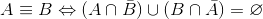

## Minimizacion
Para transformar desde una expresion regular a un automata utilizamos el algoritmo de [Thompson][thompson].
Este algoritmo nos da un automata finito no deterministico con transiciones `lambda` y completo, es decir, con el estado __trampa__.

Luego, determinizamos este automata con el algoritmo visto en la materia (powerset construction) y aplicamos el metodo de [Brzozowski][brzozowski].

Si bien tiene complejidad más alta en el peor caso, es un algoritmo muy simple de implementar.
El método consiste en revertir, determinizar, y volver a revertir el automata. Esto nos devuelve un automada minimo deterministico.
La unica complejidad que le encontramos a este algoritmo, es que los automatas intermedios tenian multiples estados iniciales.

### Ejemplos

```bash
./afd -leng ./test/minimum/aebc.regexp -aut /tmp/result_minimum
```


[thompson]: http://en.wikipedia.org/wiki/Thompson%27s_construction_algorithm
[brzozowski]: http://en.wikipedia.org/wiki/DFA_minimization#Brzozowski.27s_algorithm


## Checkear cadena

Para checkear una cadena, solo lo hacemos sobre automatas deterministicos lo cual simplifica la implementación.
Solo tenemos que recorrer la cadena, desde el nodo inicial y cortando inmediatamente cuando una transicion no existe.

### Ejemplos

```bash
./afd -aut ./test/check_string/afd0.auto abc
./afd -aut ./test/check_string/afd0.auto jkhags
./afd -aut ./test/check_string/afd1.auto abbbbbbbb
./afd -aut ./test/check_string/afd1.auto ccccc
./afd -aut ./test/check_string/afd1.auto ac
```
> NOTA: Estos ejemplos se pueden correr desde el directorio del TP.

## Intersección

En esta implementación, utilizamos el algoritmo tradicional del producto interno entre los estados de ambos
automátas y analizar la función de transición para ambos automátas.

### Ejemplos

```bash
./afd -intersec -aut1 ./test/intersection/aut1.auto \
  -aut2 ./test/intersection/aut2.auto \
  -aut /tmp/intersection_result.auto
```

## Complemento

Calcular el complemento de un automáta es realmente sencillo, sin embargo tuvimos un problema con la implementacion de `Hash`
en Ruby, que comentaremos al final del informe.

### Ejemplos

```bash
./afd.rb -complemento -aut1 ./test/complement/ab.auto \
 -aut /tmp/complement_result.auto
```

## Equivalente

Encontramos un algoritmo para calcular la equivalencia entre dos autómatas que se reduce en:



_El lenguaje generado por la union de la interseccion del autómata A con el complemento de B y
la intersección del autómata B con el complemento de A, es el vacío._

### Ejemplos

```bash
./afd.rb -equival -aut1 ./test/equivalent/afd.auto \
    -aut2 ./test/equivalent/minimum.auto
```

## Problemas y decisiones generales

### Implementación de Hash en Ruby

Al querer utilizar la función de `Hash#default` para simplificar la lectura de
código, tuvimos unos problemas por la referencia al mismo objeto. Básicamente, ruby no cuenta con inmutabilidad, lo cual al aplicar varias transformaciones al mismo autómata, nos encontrabamos con un grafo erroneo.

### Renombrar estados

Como optamos por representar la función de transición con un grafo utilizando un `hash` como estructura, donde las claves eran los nombres de los nodos, al hacer algunas transformaciones se pisaban las claves. Esto lo resolvimos renombrando los estados para garantizar la unicidad de cada uno.

### Estado Trampa

Decidimos dejar el estado trampa luego de cualquier transformación que lo agregue para eliminar ambiguedades.


